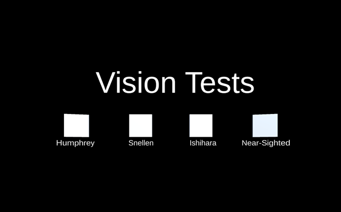

# Eye Tests VR 

An assortment of vision tests (typically administered by an optometrist) which could be conducted via a standalone virtual reality headset. 

Only supports Oculus headsets, tested with Oculus Quest and Quest 2.

Follow the instructions and choose between the Humphrey (visual perimetry), Snellen (visual acuity), Ishihara (colorblindness) tests, as well as explore a near-sighted blurry simulator.

